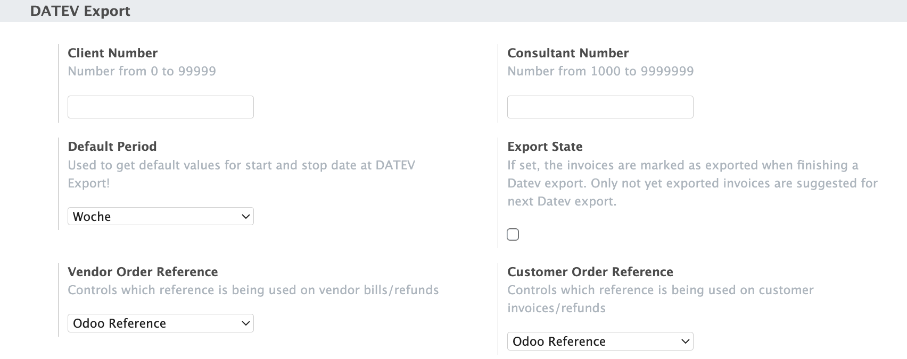
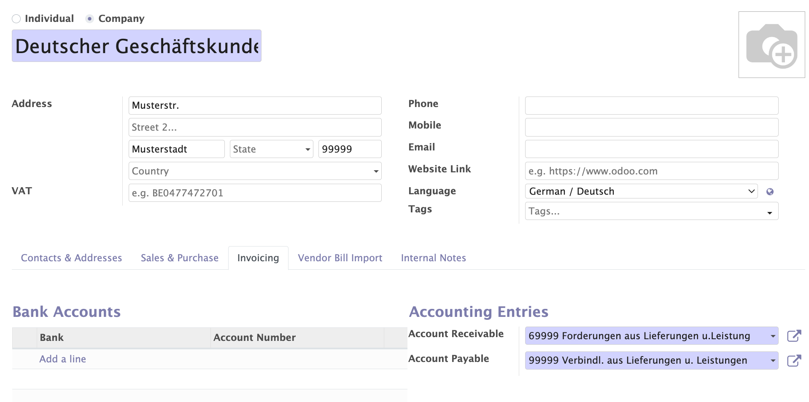

Open the **Invoicing** app or any other app and go to **Configuration > Settings**. Search for **DATEV** or find at the **Invoicing** page the **DATEV Export** section.

Here you can configure the following:

DATEV client / consultant
~~~~~~~~~~~~~~~~~~~~~~~~~

Please fill in at first  your DATEV Client and Consultant Number and click on save
button. The numbers will be displayed at the file download wizard.
The allowed numbers are the following:
Client Number: Number from 0 to 99999
Consultant Number: 1000 to 9999999

Default period
~~~~~~~~~~~~~~

You have to predefine a time period for next export wizard start and end time. Certainly this can be changed in the export wizard.

Export state
~~~~~~~~~~~~

If set, the invoices are marked as exported when finishing a Datev export. Only not yet exported invoices are suggested for next Datev export.

Order references
~~~~~~~~~~~~~~~~

it depends of the process at your tax advisors side if you want to transfer the original Odoo invoice  / bill number or the corrsponding order numbers or even the payment references. Especially the invoice matching of payments in DATEV may require to change this default setting. For both the vendor and the customer order reference you have the following options: Odoo Reference, Partner Reference, Payment Reference.

Partner configuration
~~~~~~~~~~~~~~~~~~~~~

.. hint::

    It is required to use AP/AR account numbers which could be detected by DATEV as a debitor or creditor account. You might consider to change the number of your default AR / AP accounts. DATEV logic is a +1 digit number in the ranges 10000 - 69999 (AR) and 70000 -99999 (AP) in a default 4-digits chart of accounts example

