Normally you will use the **Export Wizard** for exporting a time period. There is also a manual export option available directly from the contextual actions of the invoices and bills list view.

Export by Wizard
~~~~~~~~~~~~~~~~

The main export usage will be done by the **DATEV Export** Wizard, which can be executed from the menu item located at
**Invoicing > Reporting > Datev Export**.

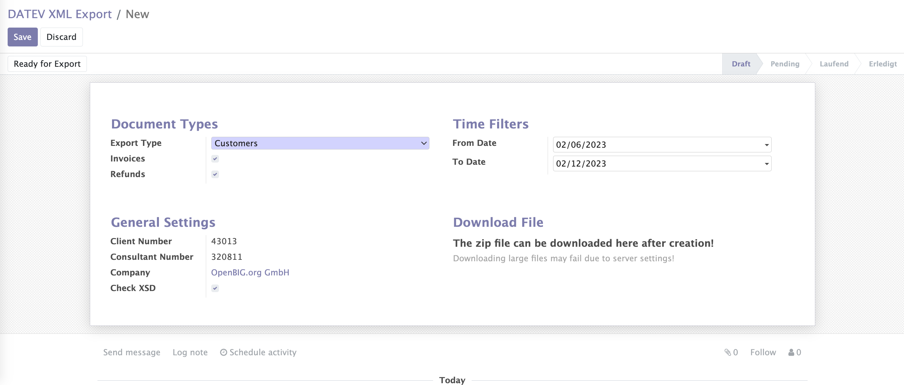

At the wizard you can filter by *Invoice types* and limit the *time range*. At the *General Settings* you can choose your company and if you want to validate the XML-Export file by the provided XSD-Schema (Recommended).

.. important::

    It's very important for a valid import at DATEV that the export file meets the requirements! So make sure that
    these flag is set when you want to upload your *ZIP-Exportfile* on a productive DATEV system.

Click on the button **Create DATEV Export File** to create the zip file for the selected filter at background.

Manual Export
~~~~~~~~~~~~~

It is also possible to export selected invoice(s) or refund(s) from the Invoices / Refunds *Action-Dropdown*. As result you can download a zip file ready to transfer to DATEV Unternehmen Online. The file contains the selected invoices / refunds as xml and pdf file and a document file which summarizes and classify all included files. This method can be handy if an exception occurs while generating a huge amount of invoices / refunds via the wizard, to fix and validate the related invoice / refund before running the wizard again.

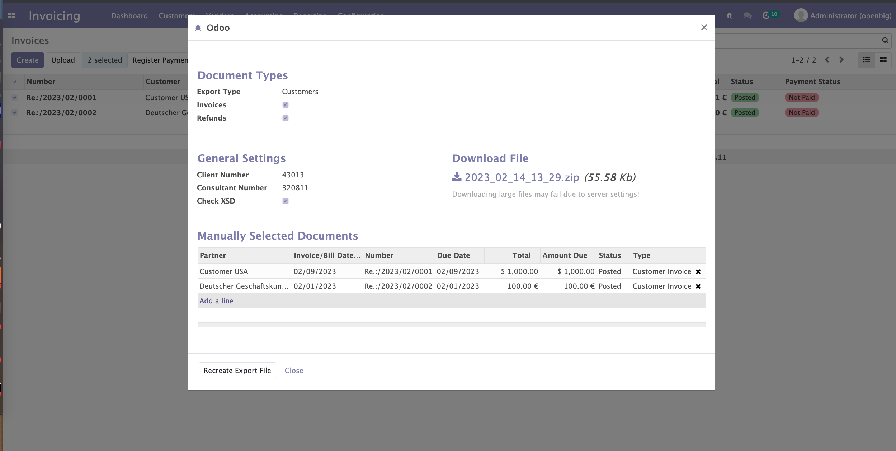

If you create a manual export from the vendor bills list the export type is „Vendors“. If you create this export from the customer invoices the export type is „Customers“.

If you have the Check XSD option, it's possible that some errors occurs.

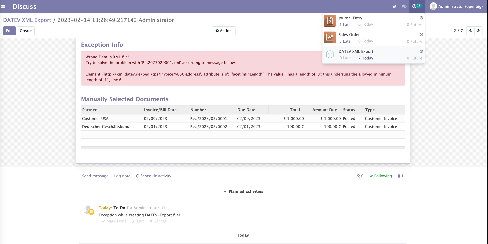

On errors, an activity will be applied to you for fixing the problem. If you have fixed the problem, just restart the wizard, or click on „Recreate DATEV Export File“. On success you can download the generated zip file from the wizards **Download DATEV File** section.

.. hint::

    The duration of the file creation depends on the number of invoices / refunds for that you will create the zip file!

Import into DATEV
=================

Requirements
~~~~~~~~~~~~

1.) DATEV Unternehmen Online is activated for the client. (In order to simply import the receipts, it is not necessary for the client to have their own access to DATEV Unternehmen Online). Please ensure you have configured the following "Advanced Settings" in DATEV Unternehmen Online in order to allow to import split account moves with many invoice lines from Invoices / Bills:

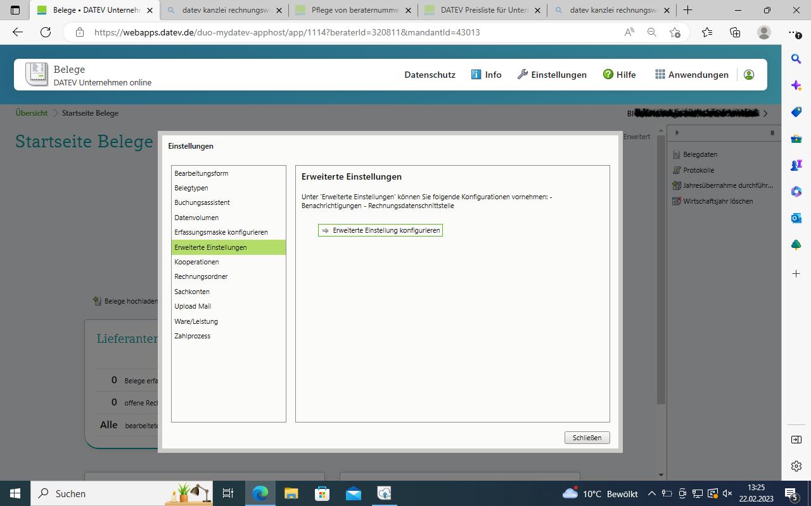

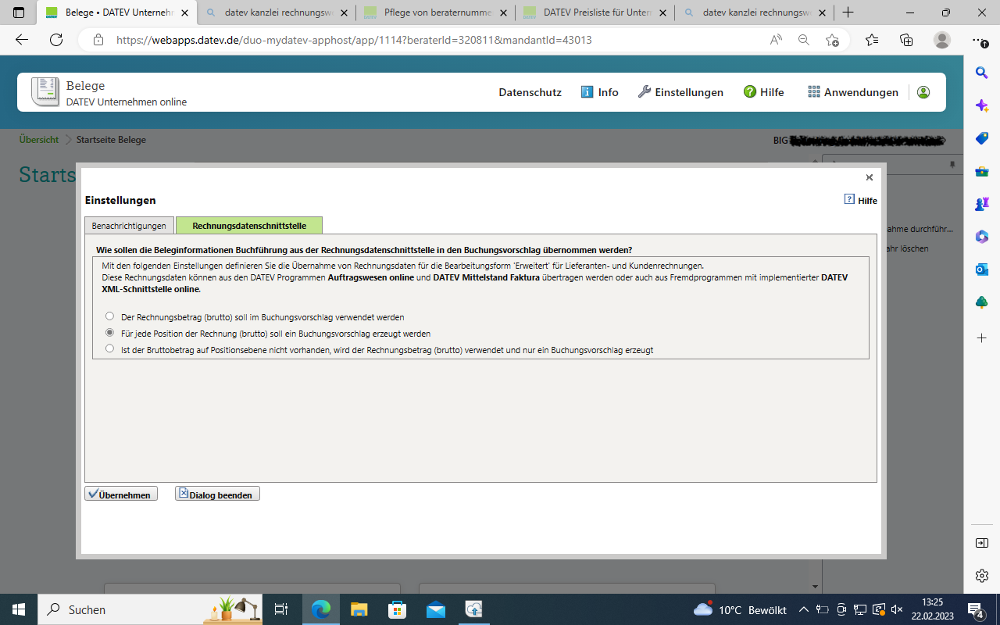

2.) The DATEV Belegtransfer program is installed and open.

Transmission to the tax advisor
~~~~~~~~~~~~~~~~~~~~~~~~~~~~~~~

The ZIP file with the document images is first exported from Odoo and saved on the client's computer. The files can then be transferred to the tax consultant in 3 different ways:

1st way: Transfer receipts and posting records with DATEV Belegtransfer

The client uploads both the ZIP file with the receipts and the CSV file with the posting records (posting batch) to DATEV Belegtransfer. The ZIP file with the receipts will be imported automatically. The invoices with the document data end up in DATEV Unternehmen Online. A provision for the tax consultant can now be made via the receipts app and the tile "Outgoing invoices" or "Incoming invoices".

2nd way: Transfer receipts and posting records outside of DATEV
The client transfers both the ZIP file with the receipts independently of DATEV receipt transfer, e.g. by e-mail or on a USB stick. The tax consultant imports the ZIP file with the documents into DATEV document transfer and then fetches the batch of postings provided from the office.

DATEV Belegtransfer
~~~~~~~~~~~~~~~~~~~~

To transfer the .zip archive from Odoo, the DATEV document transfer program „DATEV Belegtransfer“ must be installed and open. In the opened DATEV Belegtransfer application you can now click on "Add directories" and make the following settings:

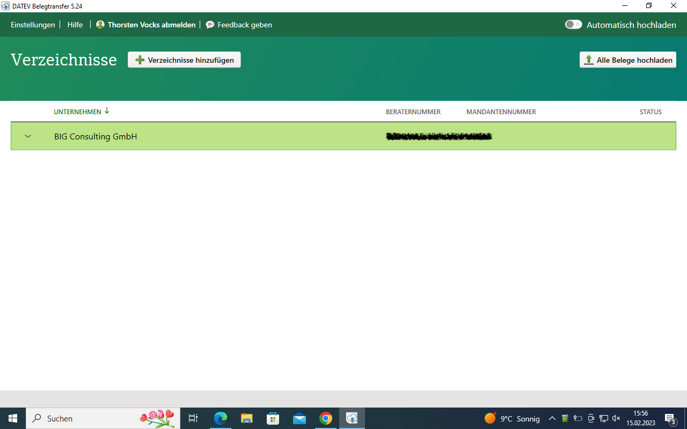

1.) "Create directories" dialog: Specify where the directories should be saved, how the company directory should be named and whether you want to delete or archive the source files after the upload. Then click on "Save".

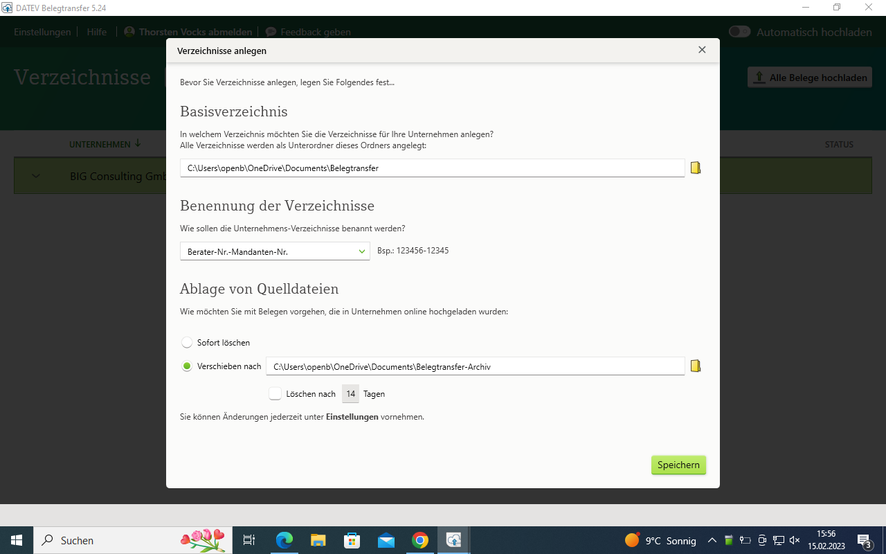

2.) Now define the directories that are to be used by first selecting the client and then clicking on "Next". You can now use the two following suggested entries and configure them as follows:
* Activate *Rechnungseingang* "Create as directory". Also activate "Configure as XML interface". To activate the XML interface, slide the slider in the "Configure as XML interface" column to the right. Then it is green. The setting is important for the transfer of the files. DATEV only reads in the receipts correctly with an activated XML interface.
* Activate *Rechnungsausgang* "Create as directory". Also activate "Configure as XML interface". To activate the XML interface, slide the slider in the "Configure as XML interface" column to the right. Then it is also green.

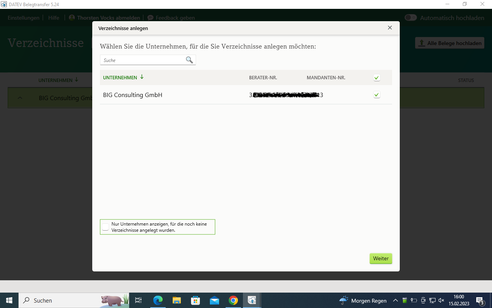

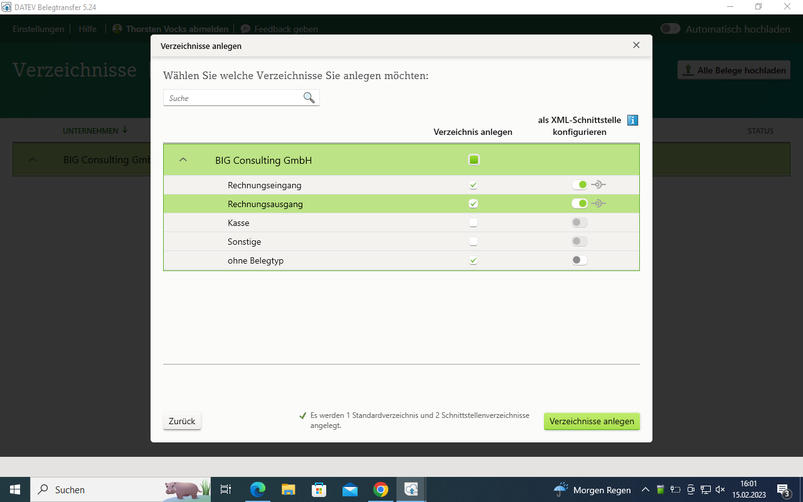

Transfer files
~~~~~~~~~~~~~~

1.) Double-click on either the “Rechnungseingang” or “Rechnungsausgang” directory. The storage location for the files to be uploaded opens. Place the file in the storage location. Make sure you put the files in the right directory:
* ZIP file for outgoing invoices from Odoo in the directory with activated XML interface „Ausgangsrechnungen“.
* ZIP file for incoming invoices from Odoo in the directory with activated XML interface „Eingangsrechnungen".
* EXCURSION: if you want to upload .csv files, e.g. exported from the datev_export_acii application, copy them to a directory without an activated XML interface (in the screenshot "Other")

You can tell for which directory the XML interface is activated by the interface symbol at the beginning of the line. If the symbol is displayed, the XML interface is activated in the directory (it should therefore be active in the two directories “Eingangsrechnungen” and “Ausgangsrechnungen”).

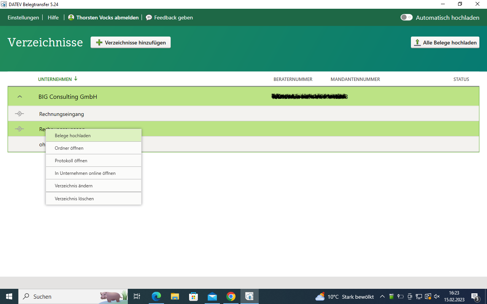

2.) Right-click on the directory. A new menu will open. Click Upload Receipts. Uploading deletes the files from the directory or moves them to an archive folder. You can specify which option should apply under Settings.

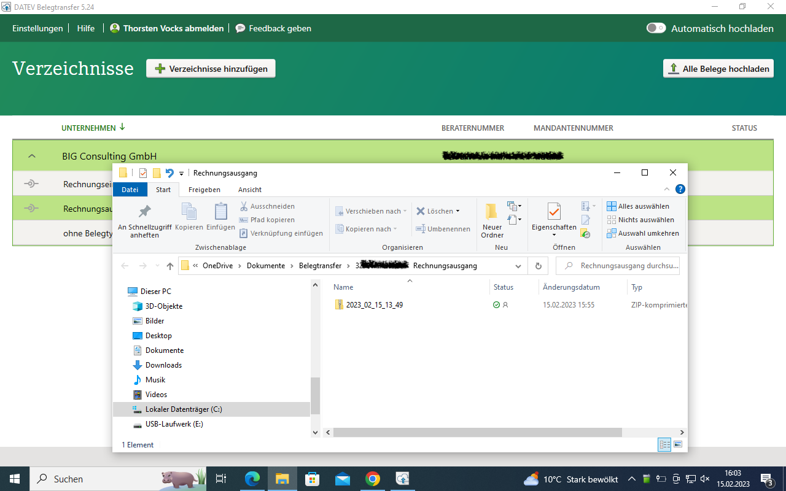

3.) To check whether the upload was successful, right-click on the directory. A new menu will open. Click Open Log. For more details click on “Import Log”

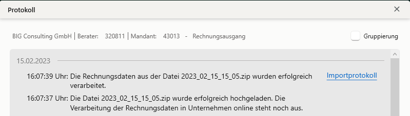

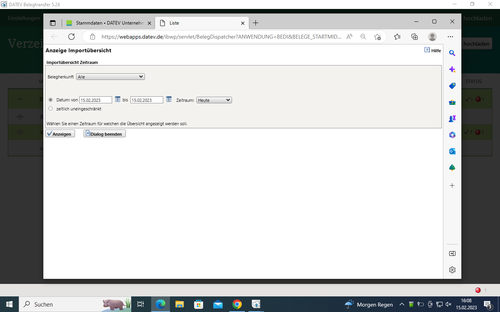

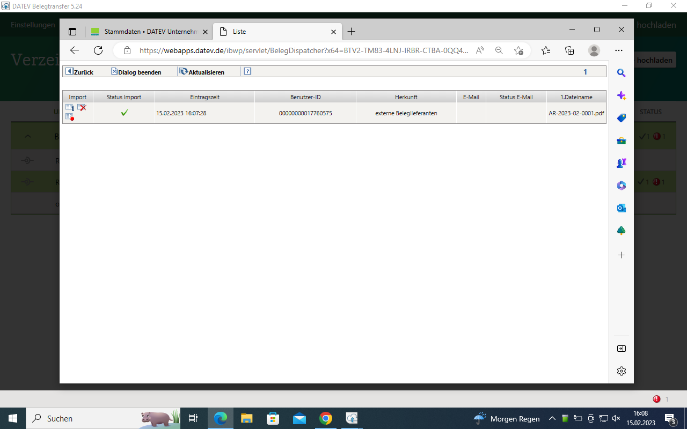

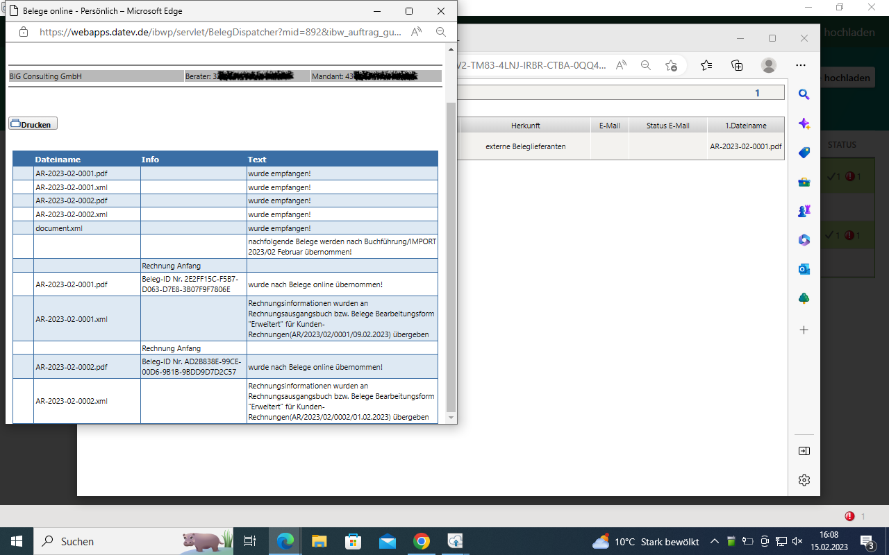

4.) Repeat steps 1 to 3 with the other directory (either for A/R invoices / A/R invoices if you want to upload those as well).

Check the import of the receipts in DATEV Unternehmen Online:

DATEV Unternehmen Online automatically recognizes that the contents of the ZIP file are receipts that belong to a batch of bookings and imports them automatically. Further actions by the tax advisor are not required. If the receipts are displayed in the DATEV Unternehmen Online inbox, your client has transferred the ZIP file with the receipts to a directory with a deactivated XML interface. Ask your client to transfer the ZIP file with the receipts again to a directory with an activated XML interface. You can delete the receipts in the inbox. You can check whether the automatic receipt import worked correctly under: Applications → Receipts → Right side menu → Logs → Import → Display import log → Select import date and "Display"

Download booking records
~~~~~~~~~~~~~~~~~~~~~~~~

1.) In DATEV Unternehmen Online:

The "Provide" („Bereitstellen“)  position is on the Receipts start page in DATEV Unternehmen Online. The batch of bookings exported from Odoo and uploaded via DATEV document transfer for „Eingangsrechnungen“ and „Ausgangsrechnugnen“ can be marked here, in order to make them ready for collection by clicking on "Provide" for DATEV Kanzlei-Rechnungswesen. With the appropriate authorization, this process can be carried out by the client himself or by the tax consultant.

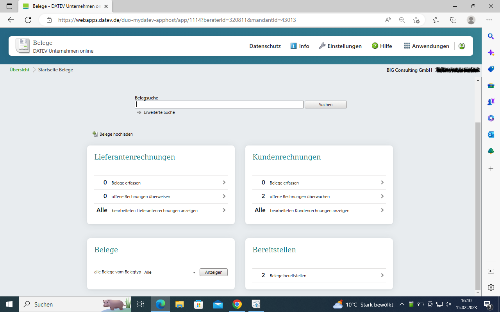

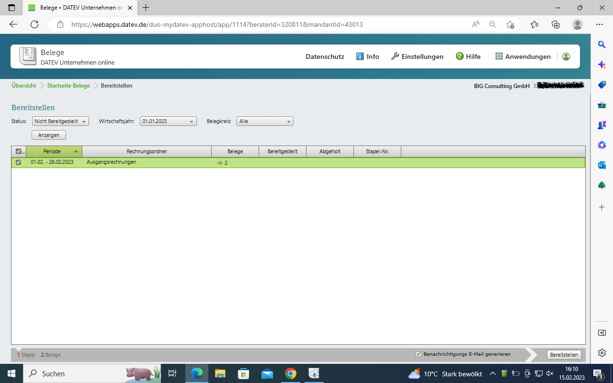

2.) In DATEV Kanzlei-Rechnungswesen, this provided data must be retrieved via client supplement.
The procedure is as follows:
Under "Preparatory activities" in your overview on the left, click on "Add client".
Select the item "Cash register/invoice stack from cash book/receipts online".
The process is started by clicking on "Get data".
The "Edit booking suggestions" function is located in your booking line. This allows you to generate the posting proposals with the voucher image.
Select your stack and confirm your selection with "Ok". You have to repeat this in the next menu. Now your booking suggestions are displayed with the original voucher images from Odoo and can be booked there.

EXCURSION for the tax consultant: If the client has also uploaded the CSV file with the posting records (posting batch) to DATEV Belegtransfer via the datev_export_ascii module, you will find this in DATEV Unternehmen Online in the inbox. Select "Download Original" to save the posting batch file on your computer. Import it from there into Kanzlei-Rechnungswesen. You can then delete the file from the inbox. In contrast to the receipts, the posting batch is not automatically recognized as such. The upload by the client using DATEV document transfer is only used for transmission to the tax consultant and could also be done by e-mail or on a USB stick.

How to deal with errors in bookings
~~~~~~~~~~~~~~~~~~~~~~~~~~~~~~~~~~~

If there are errors in the postings, we recommend editing them at the source, i.e. in Odoo, and then providing a corrected posting stack.

Current limitations / outlook
~~~~~~~~~~~~~~~~~~~~~~~~~~~~~

It is currently recommended to use a customer account according to DATEV number logic for customer accounts as the standard Odoo customer account. To do this, you can simply change the number of the existing standard customer account (e.g. 1410/1205 -> 69999). It is also recommended to use a vendor account according to DATEV number logic for vendor accounts as a standard Odoo vendor account. To do this, you can simply change the number of the existing standard vendor account (e.g. 1610/3301 -> 99999).

In future versions it is planned to optionally have two additional fields on the partner: "DATEV Debitor" and "DATEV Vendor". These accounts should be able to be assigned automatically when they are created. For accounts that already exist with the tax advisor, these two fields should be editable manually to use the tax advisor's accounts for the export. The export of the "DATEV Debitor" and "DATEV Vendor" value should then optionally be exported instead of the current Odoo debtor / vendor accounts.

Instead of the DATEV XML format type "Invoice data", the type "Ledger" should also be optionally selectable. This type includes an extended export of posting data, e.g. exchange rates for currencies etc.

With exported DATEV automatic accounts, any export of the DATEV tax key / posting key, which can be stored in Odoo for taxes, should be suppressed. This then prevents a momentary note in DATEV Kanzler-Rechnungswesen when postings are taken over (which can simply be ignored at the moment), since a posting key must also be transferred to DATEV for non-automatic accounts.

At the moment it is recommended for an identical tax statement in DATEV and Odoo not to post income/expenses with tax in journals of the “Bank” and “Cash” type. Instead, it would be better to post an incoming invoice / outgoing invoice with tax and then match the open item in the bank / cash register journal and thus post the customer / vendor as an offsetting account.

if you use Odoo just as a billing engine, then probably adoptions directly in DATEV Kanzlei-Rechnungswesen wouldn’t be a big issue. If you plan to move to a full-aaccounting approach into Odoo we would recommend to reconcile the Odoo and DATEV trial balance after each month.
