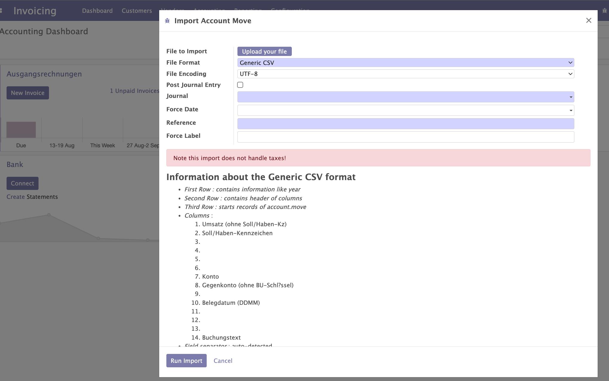
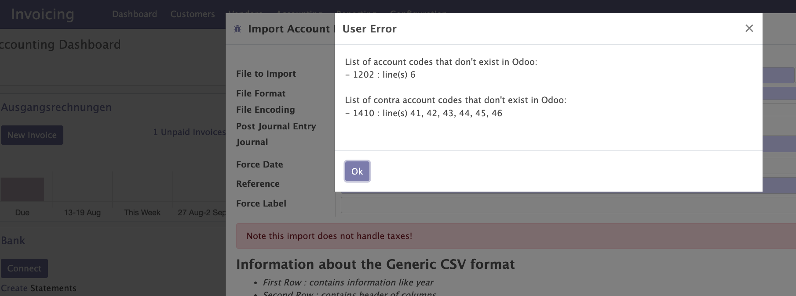

Import from DATEV into Odoo
===========================

Requirements
~~~~~~~~~~~~

#. Make sure your user has group 'Full accounting features'
#. Check if the file you want to import into Odoo is DATEV format .csv (move lines start is line 3)
#. Check the description in order to check if your use case is supported
#. Take care of the limitation to import account moves with taxes

DATEV Import
~~~~~~~~~~~~~

#. Go to `Accounting/Actions/DATEV Import`

#. Upload your DATEV format .csv file from your tax advisor

#. Take care the file format is "DATEV Format .csv" (old version: Generic CSV)

#. Take care your file encoding fits to the provided file (usually "Western (Windows-1252)"), if it is the original file from your tax advisor

#. Optionally you may activate "Post Journal Entry" in order to immidiately confirm the created Journal Entry

#. Select the mandatory journal (f.e. "Payroll Account Moves"), usually the journal type will be "Miscellaneous"

#. Enter optionally the "Force Date" field ((will be the field "Date" in your Journal Entry)

#. Enter the mandatory field  "Reference" (will be the field "Reference" in your Journal Entry)

#. Enter optionally the field "Force Label" (will be the field "Name" in your Journal Items)

#. Finally click on "Run Import"

If everyting works fine, you should now see your created Journal Entry in draft (execept you activated "Post Journal Entry")

Typical issue
~~~~~~~~~~~~~

If accounts doesen't exist in Odoo the wizard may interrupt and show you potential missing accounts.

In this case you have to ensure to create the missing accounts in Odoo.
